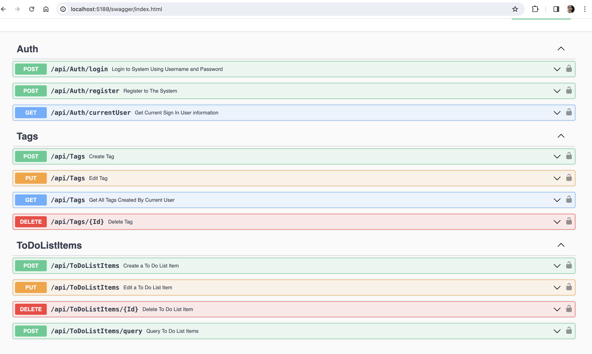

# TO-DO-List [API]

## Introduction

- A REST API application offering the management of personal To-Do-List, enriched with Tag labelling functionality.

- Users can tag and search their To-Do-List items based on their tags.

- This application uses the following technology:-
  - .NET 7
  - MSSQL Server

- A minimal infrastructure was set up at AWS Cloud to deploy this application live.

## Technical Implementation

- In general, `Dependency Injection` is used as per recommended by .NET best practice.

- Design Pattern
  - Mediator
    - Mediator is used for the sake of `Single Responsibility` and simplify code maintenance.
    - Each Mediator handler only responsible for one single functions, for example creation of item is separated from update of item.

- Authentication
  - All of the Endpoints is protected by JWT Authentication.
  - Only endpoint related to user creation is made public

- Authorization
  - A user registered to this app can only allowed to access their own created entities.

- Request Validation
    - All requests made to the API Endpoints validated automatically using `FluentValidator`

- Database
    - Database used is MSSQL Server
    - There is no limit on the MSSQL Server version used. All versions should be fine
    - ORM used is `EntityFramework`
    - The database is scripted and maintained with the help of `EntityFramework Core tool` or best known as `dotnet-ef`


## Unit Tests

Unit tests are writted using `MsTest` and tests are performed at Mediator Handlers level and Validators Level

To run the tests,
1. From the root folder, navigate to `ToDoListApiTest`
2. Open a terminal
3. Run command `dotnet test`


## Local Deployment

- Prerequisite
  - Your machine should have installed .NET SDK 7, .NET Tool `dotnet-ef` and MSSQL Server

- Setting up the Database
  1. From root folder, navigate to `ToDoListApi`
  2. Open file `appsettings.Development.json`, modify the value of `ConnectionStrings.DefaultConnection` value to point to your local MSSQL Server 
  3. Open a terminal from the folder
  4. Run command `dotnet ef database update`
  5. A fresh new database named `ToDoListDB` would be created at your MSSQL Server

- Running the Application
  1. From the root folder, navigate to `ToDoListApi`
  2. Open a terminal
  3. Run command `dotnet run`
  4. Navigate to `http://localhost:5188/swagger/index.html` to see the endpoints list
  5. You should first create a user, and then login to get the token prior calling to rest of the endpoints



## API Documentation

The following responses documented are of status code `200`. For 
response of `400` status code, the payload returned indicates the error messages for designated properties. For example
```
{
  "errors": {
    "Password": [
      "Minimum Length For Password Is 6"
    ],
    "Username": [
      "Email Already Used"
    ]
  },
  "type": "https://tools.ietf.org/html/rfc7231#section-6.5.1",
  "title": "One or more validation errors occurred.",
  "status": 400,
  "traceId": "00-745dad73c265cd43f7b9a148609ce04e-c1ebb9b2d0be585b-00"
}
```

### API: Authentication
`POST` `api/auth/register`
_Register a user to use this API_
Body
```
{
  "username": "string", //the username of user
  "password": "string" //the password of user
}
```
Response
```
{
  "id": "2eec04ea-d183-4087-da6c-08dc38d5c859" //the id of the created user
}
```

`POST` `api/auth/login`
_login a user return a JWT Token to authenticate to this API_
Body
```
{
  "username": "string", //the username of user
  "password": "string" //the password of user
}
```
Response
```
{
  "Token": "x" //the jwt token
}
```

`GET` `api/auth/currentUser`
Response
```
{
  "id": "2eec04ea-d183-4087-da6c-08dc38d5c859", //The id of the user
  "username": "abc", // the username of the user
  "createDate": "2024-02-29T03:25:10.563974" // the create date of the user
}
```

### Tags
`POST` `api/tags`
_Create Tag (Label) to use with the To-Do List Item
Body_
```
{
  "label": "tag"
}
```
Response
```
{
  "id": "fb9a83c7-2e20-480a-934d-08dc38d7d947", //The tag Id
  "label": "tag", // Tag Label Text
  "lastUpdateDate": "2024-02-29T03:38:09.422364Z" //The create date of the tag
}
```

`PUT` `api/tags`
_Update an existing tag_
Body
```
{
  "id": "fb9a83c7-2e20-480a-934d-08dc38d7d947"
  "label": "a"
}
```
Response
```
{
  "id": "fb9a83c7-2e20-480a-934d-08dc38d7d947", //The tag Id
  "label": "aatg" //The updated tag name
}
```

`GET` `api/tags`
_Get All Tags Belong to Current User_
Response
```
{
  "data": [
    {
      "id": "fb9a83c7-2e20-480a-934d-08dc38d7d947",
      "label": "aatg",
      "lastUpdateDate": "2024-02-29T03:59:49.300994"
    }
  ]
}
```

`DELETE` `api/tag/{Id}`
_Delete a tag_
_`{Id}` is the tag id to be deleted_
Response
```
{
  "success": true //Indicate the tag is deleted successfully
}
```

### API: ToDoList
`POST` `api/toDoListItems`
_Create To Do List Item_
Body
```
{
  "title": "a", //The title of the item
  "description": "b", //the description of the item
  "location": "a", //the location of the item
  "dueDate": "2024-02-29T04:02:59.599Z", //the due date of the item
  "tags": [
    "3fa85f64-5717-4562-b3fc-2c963f66afa6" //the tag to be associated with the item
  ]
}
```
Response
```
{
  "id": "139d2799-1642-4f4c-4cd9-08dc38db74a4", //the id of the created item
  "itemStatus": "NotStarted", //The item status
  "title": "a", //The title of  the item
  "description": "b", //The description of the item
  "location": "a", //The location of the item
  "dueDate": "2024-02-29T04:02:59.599Z", //The due date of the item
  "tags": [], //The tag of  the item
  "lastUpdateDate": "2024-02-29T04:03:58.565546Z" //The created date of the item
}
```

`PUT` `api/toDoListItems`
_Update an existing item_
Body
```
{
  "id": "139d2799-1642-4f4c-4cd9-08dc38db74a4", //the id of the item
  "itemStatus": "NotStarted", //The item status
  "title": "a", //The title of  the item
  "description": "b", //The description of the item
  "location": "a", //The location of the item
  "dueDate": "2024-02-29T04:02:59.599Z", //The due date of the item
  "tags": [], //The tag of  the item
}
```
Response
```
{
  "id": "139d2799-1642-4f4c-4cd9-08dc38db74a4", //the id of the item
  "itemStatus": "NotStarted", //The item status
  "title": "a", //The title of  the item
  "description": "b", //The description of the item
  "location": "a", //The location of the item
  "dueDate": "2024-02-29T04:02:59.599Z", //The due date of the item
  "tags": [], //The tag of  the item
  "lastUpdateDate": "2024-02-29T04:03:58.565546Z" //The last update date of the item
}
```

`POST` `api/toDoListItems`
_Query the To-Do-List Items by parameters_
```
{
  "searchText": "string", //The search text
  "location": "string", //The location
  "tags": [
    "3fa85f64-5717-4562-b3fc-2c963f66afa6" //The tag ids that tagged to the items
  ],
  "startDate": "2024-02-29T04:08:02.387Z", //Query the items that was last updated since the startDate
  "endDate": "2024-02-29T04:08:02.387Z", //Query the items that was last updated up till the endDate 
  "dueDate": "2024-02-29T04:08:02.387Z", //Query the items that has due date set to the dueDate
  "itemStatus": 'InProgress' , //Query the items that are in itemStatus
  "orderBy": "string", //Sort the items by the orderBy parameter, accepted values are: dueDate, title, lastUpdate
  "isDescending": true, //Sort the items in descending/ascending mode. If unset sort the items in ascending mode based on lastUpdateDate
  "skipCount": 0, //pagination, skip a number of skipCount
  "takeCount": 10 //pagination, return a number of takeCount of items
}
```
Response
```
{
  "total": 1,
  "data": [
    {
      "id": "139d2799-1642-4f4c-4cd9-08dc38db74a4", //item id
      "title": "a", //the title
      "itemStatus": 'InProgress', //the item status
      "description": "b", //The item description
      "location": "a", //The location of the item
      "dueDate": "2024-02-29T04:02:59.599", //The due date of the item
      "lastUpdateDate": "2024-02-29T04:06:24.642692", //The last update date of the item
      "tagIds": [] //The tags associated with the items
    }
  ]
}
```

`DELETE` `api/toDoListItems/{Id}`
_Delete a To-Do-List item_
_`{Id}` is the item id to be deleted_
Response
```
{
  "success": true //Indicate the item is deleted successfully
}
```

## Deployment
Deployment are performed with by Jenkins. Jenkins will pull code from Github and build an image and then push the image to ECR. Unit tests are run during building the image.

The first deployment should be made manually ECS and Fargate. Then we can automatically update the latest build to Fargate via Jenkins.

Jenkins Pipeline syntax can be found at `jenkins` folder


